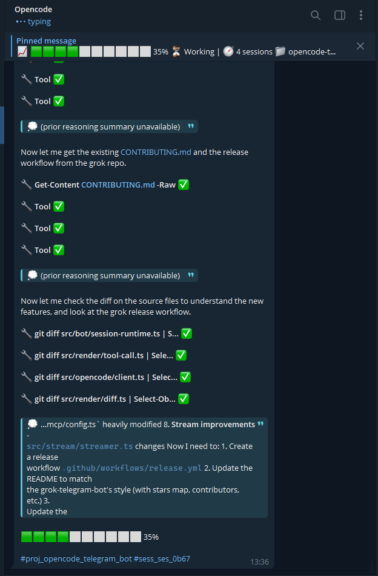
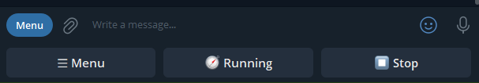
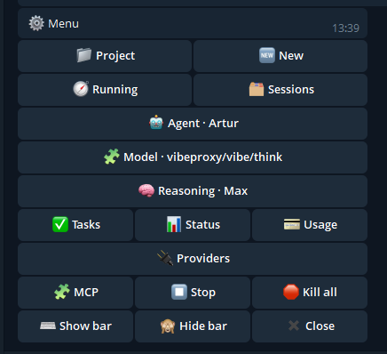
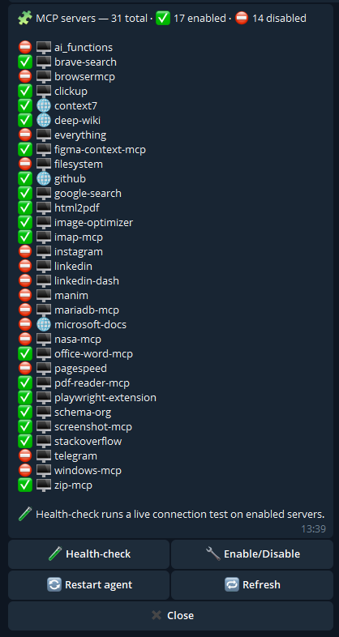
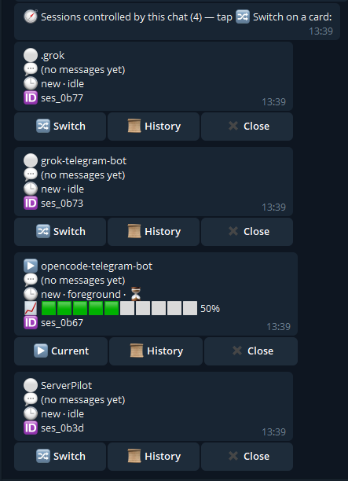
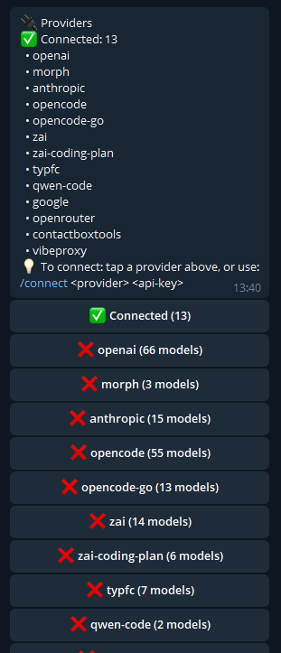
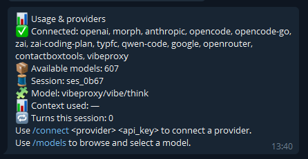
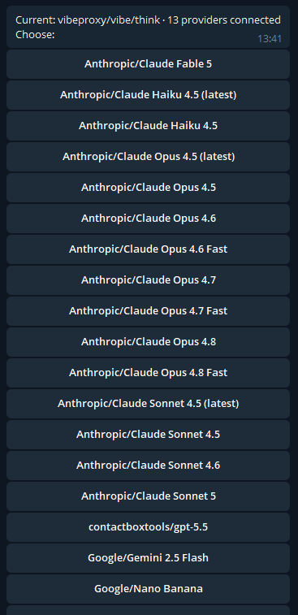

# OpenCode Telegram Bot 🤖

> **Control [OpenCode](https://opencode.ai/) from Telegram.** Your AI coding
> assistant in your pocket — switch projects, resume and attach to live coding
> sessions, stream answers with diffs, queue follow-ups, and run it 24/7 as a
> background service on Windows, Linux, and macOS.


A professional Telegram bridge that drives **OpenCode** over the **Agent Client
Protocol (ACP)** — `opencode acp` via JSON-RPC/stdio — and turns it into a
mobile, always-on AI pair programmer. Send a message from anywhere, and watch
OpenCode plan, read files, run commands, and edit code on your machine — with
live typing indicators, clean Telegram markdown, unified edit diffs, and rich
tool-call visibility.

A fork of [`artickc/kiro-telegram-bot`](https://github.com/artickc/kiro-telegram-bot),
re-architected for OpenCode ACP and extended into a full multi-session client.

---

## 📸 Screenshots

<table>
  <tr>
    <td width="50%" align="center"><b>💬 Live streaming with tool calls</b></td>
    <td width="50%" align="center"><b>🧭 Pinned status panel</b></td>
  </tr>
  <tr>
    <td width="50%" align="center"><a href="screenshots/1.png"></a></td>
    <td width="50%" align="center"><a href="screenshots/2.png"></a></td>
  </tr>
  <tr>
    <td width="50%" align="center"><b>🔍 Rich tool-call detail</b></td>
    <td width="50%" align="center"><b>📋 Session cards & switching</b></td>
  </tr>
  <tr>
    <td width="50%" align="center"><a href="screenshots/3.png"></a></td>
    <td width="50%" align="center"><a href="screenshots/4.png"></a></td>
  </tr>
  <tr>
    <td width="50%" align="center"><b>📈 Progress bar & diffs</b></td>
    <td width="50%" align="center"><b>🧩 MCP control panel</b></td>
  </tr>
  <tr>
    <td width="50%" align="center"><a href="screenshots/5.png"></a></td>
    <td width="50%" align="center"><a href="screenshots/6.png"></a></td>
  </tr>
  <tr>
    <td width="50%" align="center"><b>⚙️ Inline menu</b></td>
    <td width="50%" align="center"><b>🔐 Tool approvals</b></td>
  </tr>
  <tr>
    <td width="50%" align="center"><a href="screenshots/7.png"></a></td>
    <td width="50%" align="center"><a href="screenshots/8.png"></a></td>
  </tr>
</table>

---

## ✨ Features

| Capability | What it does |
|---|---|
| 🗂 **Projects** | `/projects` browses your folders and runs OpenCode in the one you pick. |
| ♻️ **Resume sessions** | `/sessions` lists recent OpenCode sessions; tap to resume one. |
| 🟢 **Connect to live sessions** | `/active` shows sessions running **right now** on your PC. Watch them live, or continue them — see below. |
| 🛑 **Kill a session / PID** | Each live `/sessions` · `/active` card has a **🛑 Kill · pid N** button (confirm-guarded) that stops that session's process and its child tree; `/killall` stops them all. The bot's own agent is never killable. |
| 📡 **Live watch** | Follow a running session read-only in real time (tails its event log). |
| 🧭 **Always-visible menu** | A persistent keyboard plus a pinned status panel that appears while a task runs (and clears when idle), showing your current **project, agent, reasoning, model, session and queue**. |
| ⏰ **Scheduled tasks** | Create prompts that run on a schedule (once / daily / weekly / monthly / every-N-minutes) in a chosen project, delivered back to your chat. |
| 🖼 **Multi-image prompts** | Send one or many photos (albums included) with a caption — all attached to the prompt for the agent to analyze. |
| 📜 **History** | `/history` shows the latest messages of any session. |
| 🧩 **MCP control** | `/mcp` lists MCP servers, **health-checks** them (which connected / failed and why), and **enables/disables** them — then restarts the agent to apply. |
| 👥 **Subagent visibility** | When OpenCode delegates to subagents and waits on them, you see each one **start / work / finish** plus a live `🤖 N running` summary. |
| 🔍 **Rich tool-call detail** | Every tool kind gets its own formatted card: searches (pattern + scope + filters), reads (path + line/offset), edits (diff blocks with stats), writes (content preview + syntax highlighting), deletes, moves (source → dest), shell commands (bash blocks), fetches (URL + method + body), web searches, MCP calls (server + method + args). |
| ✅ **Tool status tracking** | See ⏳ → ✅ or ❌ for each tool call as it completes. |
| 📈 **Task progress bar** | The agent appends a `{progress: N%}` marker; the bot hides it and shows a **green 0–100% loading bar** on the live message, in the status panel, and on session cards (`SHOW_PROGRESS`). Falls back to a bot-computed bar when the agent doesn't emit markers. |
| 💬 **Cost & usage** | The `✅ Done` line and `/usage` show cost used, turns this session, and provider info. |
| ⌨️ **Typing indicator** | Stays on for the whole turn, even through long tool chains. |
| 📥 **Queued follow-ups** | Message while OpenCode is busy — it's queued and runs next. `/btw` runs it ASAP (now if idle, else right after the current task); `/flush` runs the queue now. |
| ✏️ **Edit diffs** | File edits show as unified `diff` blocks with `+N -M` stats, smart-truncated for long changes. |
| 💬 **Quality markdown** | Converts agent markdown to Telegram **MarkdownV2** with safe escaping and code-fence-aware splitting. |
| 🔁 **Self-healing** | Auto-restarts the OpenCode agent with backoff and re-binds your session. Auto-fork on context-full, transient-error retry with backoff. |
| 🖥 **Runs 24/7** | 1-click install as a background service that starts on boot — Windows, Linux, macOS, auto-detected. |
| 🔒 **Access control** | Restrict to specific Telegram user IDs. |
| 🔐 **Inline approvals** | Approve/deny risky tool calls from Telegram buttons (non trust-all mode). |
| 🏷 **Threaded replies** | Every message threaded to your prompt with searchable hashtags. |
| 🧹 **Self-cleaning UI** | Transient menus auto-remove for a tidy chat history. |
| 🔄 **Auto-update** | Checks hourly, updates when idle. |
| 📎 **File ingestion** | Send documents for the agent to read. |
| 🎙 **Voice messages** | Transcribe voice to prompts (configurable STT endpoint). |

---

## 📊 How it compares

| Capability | **This bot** | Other OpenCode Telegram bots |
|---|:---:|:---:|
| Connect OpenCode to Telegram (ACP) | ✅ | ✅ |
| Switch between projects | ✅ | ❌ |
| Resume saved sessions | ✅ | ❌ |
| Attach to **live** PC sessions (watch / fork) | ✅ | ❌ |
| **Kill a session by PID** (or all at once) | ✅ | ❌ |
| **Rich tool-call detail** (search/read/edit/write/delete/move/shell/fetch/MCP) | ✅ | ❌ |
| **Tool status tracking** (⏳ → ✅ / ❌) | ✅ | ❌ |
| **Subagent visibility** | ✅ | ❌ |
| **Live task-progress bars** (`{progress: N%}`) | ✅ | ❌ |
| Multiple isolated sessions | ✅ | ❌ |
| Queued follow-ups while busy | ✅ | ❌ |
| **Scheduled tasks** (cron-like) | ✅ | ❌ |
| **Multi-image** prompts (albums) | ✅ | ❌ |
| Unified **edit diffs** (smart-truncated) | ✅ | ❌ |
| Persistent menu + live status panel | ✅ | ❌ |
| Agent / reasoning / model menus | ✅ | ❌ |
| Combined, throttled output (no spam) | ✅ | ❌ |
| Auto-restart + session re-bind | ✅ | ❌ |
| 24/7 cross-platform service | ✅ | ❌ |
| 1-click install | ✅ | ❌ |

---

## ⚡ Install from npm

The fastest way — one command installs the global **`opencode-tg`** CLI (ships with
the `tsx` runtime, no build step):

```bash
npm install -g @artickc/opencode-telegram-bot
```

By default your config lives in a **canonical, path-independent home** —
`~/.opencode/tg/` (its `.env`, `logs/`, `data/`) — so the bot loads the **same**
`.env` no matter which folder you start it from. Run `opencode-tg setup --path` to
print the exact location. (A `.env` in the current folder is still honoured
first, so existing per-folder checkouts keep working.)

```bash
opencode-tg setup            # auto-detects opencode, writes ~/.opencode/tg/.env
opencode-tg setup --path     # print the .env location
# edit that .env: set TELEGRAM_BOT_TOKEN and ALLOWED_USERS
opencode-tg run              # foreground …
opencode-tg install          # … or install as a 24/7 background service
```

The bot is **single-instance per token**: starting it again terminates any
ghost/duplicate that was still polling Telegram (the usual cause of a stale
"⛔ Not authorized"), so the fresh process with your current `.env` wins. A
plain `opencode-tg run` yields to an already-running background service instead.

Startup options: `opencode-tg setup [--path] | run | install | status | logs [n] |
stop | restart | uninstall`. Or try it without installing: `npx
@artickc/opencode-telegram-bot setup`. See **[docs/INSTALL.md](./docs/INSTALL.md)** for the
full guide.

**Already installed?** See **[docs/UPGRADE.md](./docs/UPGRADE.md)** to update to
the newest version — global npm installs auto-update when idle, or run
`npm install -g @artickc/opencode-telegram-bot@latest` and `opencode-tg restart`.

---

## 🚀 1-click install

Clone or download, then run the installer for your OS. It installs
dependencies, auto-detects `opencode`, writes `.env`, asks for your bot token,
and optionally sets up the background service.

**Windows** — double-click `install.cmd` (or in a terminal):

```powershell
.\install.cmd
```

**Linux / macOS**:

```bash
chmod +x install.sh && ./install.sh
```

### Prerequisites

- **OpenCode** installed and configured — run `opencode --version` to confirm.
- **Node.js 20+**.
- A **bot token** from [@BotFather](https://t.me/BotFather).
- Your **Telegram user ID** from [@userinfobot](https://t.me/userinfobot).

> ⚠️ **Use a dedicated bot token.** Telegram allows only one long-polling
> consumer per token. If you also run another Telegram bot on the **same** token,
> they will clash on `getUpdates`.

---

## 🧑‍💻 Manual setup

```bash
npm install
npm run setup            # auto-detects opencode + project roots, writes .env
# edit .env: set TELEGRAM_BOT_TOKEN and ALLOWED_USERS
npm start
```

No build step — TypeScript runs directly via `tsx`.

---

## 🛠 Run as a background service (daemon)

The bot installs as a **user-level** service that starts automatically on boot.
The platform is auto-detected:

| OS | Mechanism | Starts on |
|---|---|---|
| Windows | Hidden Scheduled Task (elevated) · per-user **Startup folder** (no admin) | logon |
| Linux | systemd **user** service (+ linger) | boot |
| macOS | launchd LaunchAgent | login |

On Windows, registering a logon-triggered Scheduled Task needs admin, so from a
normal terminal `opencode-tg install` falls back to a hidden launcher in your
per-user **Startup folder** (starts at logon, no elevation). Run it from an
**elevated** terminal to use the Scheduled Task instead; either way `status`,
`stop`, `restart` and `uninstall` work the same.

```bash
npm run install:service     # install + start, enable autostart
npm run service -- status   # show install + running state
npm run service -- stop
npm run service -- restart
npm run service -- logs 200 # tail the log file
npm run uninstall:service   # stop + remove
```

Or use the `opencode-tg` command (if linked): `opencode-tg install | status | logs`.

Logs are written to `logs/opencode-telegram-bot.log` (rotated at 5 MB).

---

## 💬 Commands

```
/menu         Show the persistent menu keyboard
/projects     List · /projects <q> search · /projects <path> open any folder · /projects new <name>
/sessions     List & resume sessions (active first) · /sessions <q> to filter
/active       Sessions running now on the PC
/running      Sessions this chat controls — switch between them
/killall      Kill all active sessions on the PC (with confirm)
/mcp          Inspect MCP servers · health-check · enable/disable
/tasks        Manage scheduled tasks
/newtask      Create a scheduled task (wizard)
/history      Show recent conversation history
/new          Start a fresh session here
/status       Current session, project & queue
/usage        Provider info & current context usage
/btw <text>   Run it now if idle, else queue to run right after the current task
/flush        Send queued follow-ups now
/queue        Show queued follow-ups
/clearqueue   Clear the queue
/cancel       Stop the current turn
/unwatch      Stop following a live session
/model <id>   Switch the model for this session
/restart      Restart the OpenCode agent
/help         Show help
```

Anything that isn't a command is sent to OpenCode as a prompt. While a turn is
running, your messages are queued and sent automatically when it finishes.

---

## 🧭 The menu & status panel

A tiny **persistent bar** sits under the message box — **☰ Menu · 🧭 Running ·
⏹ Stop** — so common actions are one tap away without clutter. Tap **☰ Menu**
(or `/menu`) to open a clean, grouped **inline menu**: Project · New · Running ·
Sessions · Agent · Model · Reasoning · Tasks · Status · Usage · Stop · Kill all.
The bar can be hidden (🙈) and restored (⌨️ Show bar or `/menu`).

While a task is running, a **pinned status panel** appears at the top of the chat
showing your current **task progress, activity, queue, project, session, context
%, agent, reasoning effort and model** (and how many sessions the chat controls),
updating live — and it's **removed when the session goes idle** so the chat stays
clean between tasks (use **Status** in the menu to see it on demand any time).
Pick **Agent**, **Reasoning** or **Model** from the inline menu (reasoning steers
how thoroughly the agent works: Minimal → Max).

## ⏰ Scheduled tasks

A task is a **prompt + a project + a schedule**. When it fires, the bot opens a
session in that project, runs the prompt, and delivers the result to your chat.

- **/newtask** (or the ➕ button) launches a guided wizard: name → prompt →
  project → schedule → confirm.
- **Schedules**: `once` at a date/time, `daily` at HH:MM, `weekly` (e.g. `Mon 09:00`),
  `monthly` (e.g. `15 09:00`), or `interval` (every N minutes).
- **/tasks** lists everything with buttons to **run now, enable/disable, edit**
  (rename, prompt, project, reschedule) and **delete**.

Tasks are stored in `data/tasks.json` and survive restarts; the scheduler runs
them whether you're online or not (great with the 24/7 service).

## 🖼 Sending images

Send one or several photos — including a Telegram **album** — with an optional
caption. The bot downloads them and attaches them all to the prompt as image
content blocks, so the agent can analyze them together. Images sent while OpenCode
is busy are queued with your next turn.

**Images come back too:** when the agent produces images during a turn (e.g.
takes screenshots while testing an app), the bot detects the freshly-written
files and sends them back to Telegram automatically (`SEND_AGENT_IMAGES`).

## 🎙 Sending voice

Send a voice note (or audio file) and the bot transcribes it and runs it as a
prompt. Configure any OpenAI/Whisper-compatible endpoint via `STT_API_URL` in
`.env`; leave `STT_LANGUAGE` blank for automatic detection (English, Russian,
Romanian/Moldovan, and ~100 more).

## 📎 Sending files

Send any **document** and the bot resolves it. **Text-like files** — a long
message your Telegram client turned into a `.txt`, plus code, logs, JSON, CSV,
Markdown, and more — are downloaded, decoded, and inlined into the prompt (up to
`DOC_MAX_CHARS`, then truncated with a note), so the agent reads the whole thing.
**Binary files** are saved under `<data>/downloads` and their path is handed to
the agent to open with its own tools. An optional caption becomes the
instruction; files sent while OpenCode is busy are queued with your next turn.

## ↩️ Replying for context

**Reply** to any message (yours or the bot's) and the referenced content rides
along with your new message, so a terse "fix this" or "why?" keeps its meaning.
If you highlight a specific **quote** while replying, the bot forwards that exact
excerpt plus the surrounding message. Works for text, photo, voice and file
prompts alike (long quotes are trimmed to keep prompts lean).

## 📈 Task progress

The bot asks the agent to end each message with a `{progress: N%}` marker, then
**hides the marker** and renders a **green loading bar** from 0–100 %
(`🟩🟩🟩🟩🟩⬜⬜⬜⬜⬜ 50%`, all-green ✅ at 100 %) so you can see how far along the
current task is. The bar appears at the bottom of the **live message**, in the
pinned **status panel**, and on **`/running` and `/sessions` cards**. Markers are
also stripped from history, replays and previews, so the raw plumbing never
shows. Turn it off with `SHOW_PROGRESS=false`.

That marker is only an instruction the model can ignore — weaker/free models and
long, tool-heavy turns often emit none, which used to leave the bar empty for the
whole turn. So when `SHOW_PROGRESS` is on but no marker arrives, the bot falls
back to a **computed** bar derived from real activity (completed tool calls,
streamed output, elapsed time): it starts low, climbs as work advances, and fills
to 100 % when the turn completes. The agent's own marker, when present, always
takes precedence and the value never decreases. Disable the fallback with
`PROGRESS_FALLBACK=false`.

---

## 🧭 Working on several sessions at once

One chat can drive **multiple OpenCode sessions** and switch between them. Start
a session (📁 Project / 🆕 New), and each becomes a "controlled" session. Tap
**🧭 Running** (or `/running`) to switch: the foreground session streams live
while the others keep working quietly. When you switch to a session you see its
recent context and **every message that arrived while you were away** (its
unread, recovered from the session log). Leave a task running in A, hop to B,
reply, and come back to A to read what it did. Close a session with ✖ (it isn't
killed) — or tap **🛑 Kill · pid N** on its `/sessions` · `/active` card to stop
its process (and `/killall` to stop them all).

## 🔗 Connecting to live sessions

While a turn is running, the bot marks that session busy (a `.lock` with the live
child's pid), so a second turn can't collide with it. You can still:

- **📡 Watch** — follow the running session's output live (read-only) by tailing
  its event log. Stop with `/unwatch`.
- **Continue (fork)** — tapping a live session opens a **linked continuation** in
  the same project, primed with the recent transcript, so you can keep
  interacting from Telegram without disturbing the running turn.

Resuming an **idle** session loads it directly so you continue the exact thread.

---

## ⚙️ Configuration (`.env`)

| Variable | Required | Default | Description |
|---|---|---|---|
| `TELEGRAM_BOT_TOKEN` | **yes** | — | Bot token from @BotFather. |
| `ALLOWED_USERS` | recommended | *(all)* | Comma-separated Telegram user IDs. Empty = anyone (unsafe). |
| `OPENCODE_PATH` | no | auto / `opencode` | Path to the `opencode` binary. |
| `OPENCODE_WORKSPACE` | no | cwd | Default working directory. |
| `OPENCODE_AGENT` | no | — | Custom agent from `.opencode/agents/`. |
| `OPENCODE_TRUST_ALL_TOOLS` | no | `true` | Run tools without prompts. |
| `PROJECT_ROOTS` | no | workspace parent + home | Roots for `/projects`. |
| `STREAM_THROTTLE_MS` | no | `1500` | Live-edit interval while streaming. |
| `MESSAGE_BATCH_MS` | no | `800` | Window to coalesce rapid text messages into one prompt. `0` disables. |
| `SHOW_TOOL_CALLS` | no | `true` | Show tool-call status messages. |
| `SHOW_EDIT_DIFFS` | no | `true` | Show unified diffs for edits. |
| `DIFF_MAX_LINES` | no | `40` | Max diff lines shown inline (smart-truncated). |
| `DOC_MAX_CHARS` | no | `100000` | Max characters of a text file attachment inlined into the prompt. |
| `SHOW_SUBAGENTS` | no | `true` | Stream subagent start/work/finish while the main agent waits. |
| `SHOW_PROGRESS` | no | `true` | Ask the agent to append a `{progress: N%}` marker to each message; the bot parses it, hides the marker, and renders a green 0–100% bar. |
| `PROGRESS_FALLBACK` | no | `true` | When `SHOW_PROGRESS` is on but the agent emits **no** marker, render a **bot-computed** bar derived from real activity. |
| `NOTIFY_OTHER_SESSIONS` | no | `true` | Deliver a session's "Done" summary even when it's a background session. |
| `MCP_PROBE_TIMEOUT_MS` | no | `8000` | Per-server timeout for the `/mcp` live health-check. |
| `MCP_PROBE_CONCURRENCY` | no | `6` | How many MCP health probes run at once. |
| `OPENCODE_AUTO_RESTART` | no | `true` | Auto-restart the agent if it exits. |
| `OPENCODE_TG_SINGLE_INSTANCE` | no | `true` | Enforce one running bot **per token**. |
| `AUTO_UPDATE` | no | `true` | Hourly check npm and, when a newer version exists **and the bot is idle**, auto-update + restart + post the release notes. |
| `UPDATE_CHECK_MS` | no | `3600000` | How often to check npm for updates (ms). |
| `PROMPT_RETRY_ATTEMPTS` | no | `5` | Max retries for a transient agent error before any output streamed, with `6s → 12s → 24s → 48s → 60s` backoff. |
| `AUTO_FORK_ON_ERROR` | no | `true` | When retries are exhausted on a transient error, **logically fork** the session and retry the message once. |
| `AUTO_FORK_CONTEXT_PCT` | no | `85` | When a prompt fails transiently **and** context usage is at/above this %, **skip the retry backoff and fork immediately**. |
| `RESUME_ON_STREAM_ERROR` | no | `true` | When a transient error strikes **after the reply already began streaming**, ask the same session to continue from where it stopped. |
| `QUIET_NOTIFICATIONS` | no | `true` | Send messages silently (no notification sound) except for turn-completing messages. |
| `LOG_LEVEL` | no | `info` | `debug` \| `info` \| `warn` \| `error`. |
| `LOG_DIR` / `LOG_FILE` | no | `<project>/logs/…` | Log location. |

See `.env.example` for the full list with comments.

---

## 🧩 How it works

```
Telegram  ──HTTPS──▶  Bot (grammY)
                         │  spawns once
                         ▼
        opencode acp  ◀── JSON-RPC 2.0 over stdio (ACP) ──▶  Bot
                         │
                         ├─ initialize              (handshake)
                         ├─ session/new · session/load  (projects, resume)
                         ├─ session/prompt          (your messages)
                         └─ session/update          (streamed text, tools)
```

One `opencode acp` process multiplexes many sessions. After `initialize` the
bot runs `session/new` or `session/load`, then streamed `session/update`
notifications are assembled into a live, throttled message and `tool_call`
updates render as status cards with diffs and completion status.

The bot records the sessions **it** drives on disk under `<data>/sessions/`:
`<id>.json` (metadata), `<id>.jsonl` (history, used by `/history` and live
watch), and `<id>.lock` (written while a turn runs, for active detection).

---

## 📁 Project layout

```
src/
├── index.ts              Entry point, daemon-friendly logging, shutdown
├── cli.ts                CLI: run / install / start / stop / status / logs
├── config.ts             .env loading, paths, daemon options
├── logger.ts             Leveled logger with file output
├── opencode/             OpenCode ACP bridge: client, transport, types
├── sessions/             Session discovery, history parser, live tail watcher
├── projects/             Project directory discovery
├── mcp/                  MCP config (list/toggle) + live health probe
├── render/               Markdown→MarkdownV2, diffs, tool formatting, chunking
├── stream/               Incremental edit-streaming
├── service/              Cross-platform daemon (windows/linux/macos + selector)
└── bot/                  grammY bot, per-chat runtime, handlers
```

---

## ❓ FAQ

**Can I run the OpenCode Telegram bot 24/7 on a server?** Yes — `npm run install:service`
installs a user-level service (systemd/launchd/Scheduled Task) that starts on
boot and auto-restarts on crash.

**How do I control OpenCode from my phone?** Set up the bot, message it on Telegram,
and pick a project with `/projects`. Every message becomes a prompt.

**Can multiple people use one bot?** Add their IDs to `ALLOWED_USERS`. Each chat
gets its own session.

**Does it support custom agents and MCP servers?** Yes — set `OPENCODE_AGENT`,
and the bot works with MCP servers configured in OpenCode's config.

---

## 🔐 Tool approvals

When OpenCode asks the client to approve a risky tool call, it appears in Telegram
with **Approve / Deny** buttons. Set `OPENCODE_TRUST_ALL_TOOLS=false` to enable
this mode. You can also intervene on any live turn with the tool stream + **⏹ Stop**
(`/cancel`), which cancels that session's turn.

## 🔐 Security

This bot lets authorized Telegram users run commands and edit files on the host.
**Always set `ALLOWED_USERS`**, keep `.env` private, and run as a non-privileged
user. See [SECURITY.md](./SECURITY.md) for the full model.

---

## 🗺 Roadmap

- [x] Projects, resume & attach to live sessions
- [x] Queued follow-ups, edit diffs, quality MarkdownV2
- [x] Persistent menu + live status panel (project / agent / reasoning / model)
- [x] Scheduled tasks (once / daily / weekly / monthly / interval)
- [x] Multi-image prompts (albums)
- [x] Combined, throttled output (anti-spam)
- [x] 24/7 cross-platform background service
- [x] Voice messages → speech-to-text → prompt (multi-language)
- [x] Context-usage % in the status panel
- [x] Inline approvals — approve/deny risky tools from buttons
- [x] Rich tool-call detail for every kind (search/read/edit/write/delete/move/shell/fetch/MCP)
- [x] Tool status tracking (⏳ → ✅ / ❌)
- [x] Subagent visibility
- [x] Release automation — downloadable zip + CHANGELOG-driven notes on tag push
- [x] README community sections — Contributors, Top Contributors, Stars, StarMapper
- [ ] **Token & cost meter** — per-session token counts and an estimated spend tally
- [ ] **Text-to-speech replies** — optionally speak answers back as voice notes
- [ ] **Scheduled-task chaining & conditions** — run task B after A
- [ ] **Team mode** — multiple authorized users with per-user sessions, roles, and an audit log
- [ ] Localized bot UI (i18n)
- [ ] Docker image with `opencode` preinstalled
- [ ] Webhook mode for serverless deployment

Have an idea? Open a [feature request](../../issues/new/choose).

## 🤝 Contributing

Contributions are very welcome! See **[CONTRIBUTING.md](./CONTRIBUTING.md)** to get
started — no build step is required (`npm run dev`), and `npm run typecheck` must
pass.

New here? Look for issues labeled
[**good first issue**](../../issues?q=is%3Aopen+label%3A%22good+first+issue%22)
and [**help wanted**](../../issues?q=is%3Aopen+label%3A%22help+wanted%22).

By participating you agree to the [Code of Conduct](./CODE_OF_CONDUCT.md).

---

## 👥 Contributors

[](https://github.com/artickc/opencode-telegram-bot/graphs/contributors)

### How to Contribute

1. Fork the repository
2. Create your feature branch (`git checkout -b feat/amazing-feature`)
3. Commit your changes (`git commit -m 'Add amazing feature'`)
4. Push to the branch (`git push origin feat/amazing-feature`)
5. Open a Pull Request

See [CONTRIBUTING.md](./CONTRIBUTING.md) for detailed guidelines.

### Releasing a New Version

```bash
# Bump the version, update CHANGELOG.md, then push a tag.
# The release workflow builds a downloadable zip and publishes notes automatically.
npm version minor              # or: patch / major — updates package.json + commits
git push --follow-tags         # pushing the v* tag triggers .github/workflows/release.yml
```

---

## ⭐ Top Contributors

> This project is built and maintained in the open. These people have made the
> contributions that shape its quality, stability, and reach. **Thank you.**

<table>
  <tr>
    <td align="center" width="180">
      <a href="https://github.com/artickc">
        <br/>
        <sub><b>artickc</b></sub>
      </a><br/>
      🥇 Maintainer<br/>
      <sub>Created the bot: OpenCode ACP bridge, multi-session<br/>runtime, scheduler, daemon &amp; renderer</sub>
    </td>
  </tr>
</table>

> 🙏 Every pull request, bug report, and idea matters. Open source is built by
> people like them — see the full list under [Contributors](#-contributors).

---

## 📊 Stars

<a href="https://www.star-history.com/?repos=artickc%2Fopencode-telegram-bot&type=date&legend=top-left">
  <picture>
    <source media="(prefers-color-scheme: dark)" srcset="https://api.star-history.com/svg?repos=artickc/opencode-telegram-bot&type=Date&theme=dark&legend=top-left" />
    <source media="(prefers-color-scheme: light)" srcset="https://api.star-history.com/svg?repos=artickc/opencode-telegram-bot&type=Date&legend=top-left" />
    
  </picture>
</a>

If this project helps you, please consider giving it a ⭐ — it really helps!

---

## 🌍 StarMapper

> See where in the world this project's stargazers live — an interactive map of
> the community.

<a href="https://starmapper.bruniaux.com/artickc/opencode-telegram-bot">
  <picture>
    <source media="(prefers-color-scheme: dark)" srcset="https://starmapper.bruniaux.com/api/map-image/artickc/opencode-telegram-bot?theme=dark" />
    <source media="(prefers-color-scheme: light)" srcset="https://starmapper.bruniaux.com/api/map-image/artickc/opencode-telegram-bot?theme=light" />
    
  </picture>
</a>

---

## 📦 Download & Releases

Grab the latest packaged build from the
[**Releases**](https://github.com/artickc/opencode-telegram-bot/releases) page — each
release ships a clean `opencode-telegram-bot-<version>.zip` (no `node_modules` or
secrets) plus GitHub's source archives. See [CHANGELOG.md](./CHANGELOG.md) for
what changed in each version, **[docs/INSTALL.md](./docs/INSTALL.md)** for the
full 1-click install guide, and **[docs/UPGRADE.md](./docs/UPGRADE.md)** for how
to update an existing install.

---

## 📄 License

[MIT](./LICENSE) — see also [CONTRIBUTING](./CONTRIBUTING.md) and
[Code of Conduct](./CODE_OF_CONDUCT.md).

---

<sub>Keywords: OpenCode Telegram bot, AI coding assistant on Telegram, mobile AI
pair programming, remote coding agent, run AI agent as a service,
Windows/Linux/macOS daemon, ChatOps for developers.</sub>
